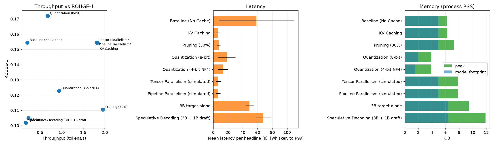

# UdaciHeadline — LLM Inference Optimization

Course repository for **LLM Inference Optimization** (Udacity `cd14455`). It contains the four
lesson exercise notebooks and the capstone project **UdaciHeadline**: optimising a
Llama‑3.2‑1B headline‑generation pipeline (baseline → KV‑cache → pruning → quantization →
distributed inference → speculative decoding) and reporting the latency / throughput /
memory / ROUGE trade‑offs.

## Repository layout

```
.
├── dataset/                              News Category Dataset (HuffPost, JSON lines)
├── lesson-1-Introduction_to_LLM_Inference_Optimization/
├── lesson-2-Transformer_Architecture_Optimizations /
├── lesson-3-Quantization_Pruning_and_Speculative_Decoding/
├── lesson-4-Model_Parallelism_Sharding_and_Deployment/
│   └── exercises/{starter,solution}/     starter notebooks (solved in-place) + reference solutions
├── project/
│   ├── UdaciHeadline_Project_Starter.ipynb   the project notebook (all steps + benchmarks)
│   └── README.md
├── requirements.txt                      Python dependencies (torch installed separately, see below)
├── setup_env.sh                          one-shot environment bootstrap (uv or venv)
└── env_check.py                          verifies packages, hardware, dataset and model cache
```

## Environment setup

Tested with Python 3.12, PyTorch 2.13, transformers 5.15, datasets 5.0, evaluate 0.4.6,
accelerate 1.14, bitsandbytes 0.50, optimum‑quanto 0.2.7, DeepSpeed 0.19 (CPU accelerator).

```bash
# 1. Create .venv and install everything (auto-detects CUDA; pass "cpu" or "cuda" to force)
./setup_env.sh

# 2. Verify
.venv/bin/python env_check.py

# 3. Launch notebooks with the registered kernel "Python (udaciheadline)"
.venv/bin/jupyter lab
```

Manual equivalent:

```bash
uv venv --python 3.12 .venv
uv pip install --python .venv/bin/python --index-url https://download.pytorch.org/whl/cpu torch   # or plain `torch` for CUDA
uv pip install --python .venv/bin/python -r requirements.txt
DS_BUILD_OPS=0 uv pip install --python .venv/bin/python deepspeed   # optional
```

### Model & data

* **Model:** `unsloth/Llama-3.2-1B` — an ungated mirror of Meta's `meta-llama/Llama-3.2-1B`
  weights (identical tensors) that downloads without an access token. If you have Meta access
  set `UDACI_MODEL=meta-llama/Llama-3.2-1B` (or a local path such as
  `/voc/shared/models/llama/Llama-3.2-1B` in the Udacity workspace).
* **Dataset:** `dataset/News_Category_Dataset.json` (≈210k HuffPost articles with
  `headline` and `short_description`), loaded with `datasets.load_dataset("json", ...)`.

### Hardware notes

Everything in this repo runs on CPU (that is how the results in this repo were produced —
see the hardware table in the project report) but a CUDA GPU is strongly recommended:

| Feature | CPU | CUDA GPU |
|---|---|---|
| Baseline / KV cache / pruning | ✅ (fp32, slow) | ✅ (bf16) |
| bitsandbytes 8‑bit / 4‑bit | experimental (falls back to `optimum-quanto` int8/int4) | ✅ |
| Tensor / pipeline parallelism | simulated with `accelerate` device maps | ✅ multi‑GPU |
| Speculative decoding | ✅ | ✅ |
| DeepSpeed pipeline (Lesson 4) | CPU accelerator, gloo backend | ✅ |

## Running the tests / notebooks headlessly

```bash
.venv/bin/jupyter nbconvert --to notebook --execute --inplace \
    "lesson-1-Introduction_to_LLM_Inference_Optimization/exercises/starter/L1E1 Profiling Your First LLM Starter.ipynb"
```

## Project results (UdaciHeadline)

Headline generation with Llama‑3.2‑1B, benchmarked on an Intel i7‑10610U (4 cores, no GPU), fp32,
20 eval samples, greedy decoding, ≤ 24 new tokens. Full details, methodology and analysis:
[`project/REPORT.md`](project/REPORT.md) (PDF: [`project/REPORT.pdf`](project/REPORT.pdf)); notebook:
[`project/UdaciHeadline_Project_Starter.ipynb`](project/UdaciHeadline_Project_Starter.ipynb); raw data:
[`project/results/`](project/results/); setup and run instructions: [`project/README.md`](project/README.md).

| Optimization | Mean latency (s) | P99 (s) | Throughput (tok/s) | Peak mem (GB) | ROUGE‑1 | Speed‑up |
|---|---|---|---|---|---|---|
| Baseline (no KV cache) | 58.39 | 109.53 | 0.20 | 6.20 | 0.154 | 1.00× |
| **KV caching** | **6.50** | 9.06 | **1.83** | 6.26 | 0.154 | **8.98×** |
| Pruning 30 % (unstructured, + KV) | 7.15 | 9.75 | 1.96 | 7.27 | 0.111 | 8.17× |
| Quantization 8‑bit (bitsandbytes, + KV) | 18.24 | 29.96 | 0.67 | **3.92** | 0.172 | 3.20× |
| Quantization 4‑bit NF4 (+ KV) | 13.42 | 20.17 | 0.94 | 3.91 | 0.123 | 4.35× |
| Tensor parallelism (single‑device simulation) | 6.57 | 9.97 | 1.81 | 7.87 | 0.154 | 8.88× |
| Pipeline parallelism (single‑device simulation) | 6.57 | 9.58 | 1.81 | 7.83 | 0.154 | 8.89× |
| Llama‑3.2‑3B target alone (bf16, 8 samples) | 49.00 | 54.58 | 0.23 | 9.44 | 0.105 | 1.19× |
| Speculative decoding 3B + 1B draft, K=5 | 67.83 | 78.43 | 0.17 | 11.90 | 0.102 | 0.86× |



**Take‑aways:** the KV cache is the dominant win (9× at identical output); int8 quantization halves the
weight footprint (−37 % peak memory) at unchanged quality but is slower on the CPU bitsandbytes backend;
unstructured pruning gives no speed/memory benefit and −28 % ROUGE‑1; tensor/pipeline parallelism is
unnecessary for a 1B model; speculative decoding does not pay on a compute‑bound CPU (K sweep flat) but
is the tool for GPU deployments of the 3B model. Recommendation: **bf16 + KV cache, batched, on one GPU;
add int8 when memory‑constrained** (report §7).

The lesson exercise notebooks (`lesson-*/exercises/starter/*.ipynb`) are solved in place and executed;
their outputs and written analyses are inside the notebooks.

## Built With

* [PyTorch](https://pytorch.org/) — tensor library, profiler, `torch.nn.utils.prune`
* [Transformers](https://huggingface.co/docs/transformers) / [Accelerate](https://huggingface.co/docs/accelerate) — model loading, `generate()`, device maps
* [Datasets](https://huggingface.co/docs/datasets) / [Evaluate](https://huggingface.co/docs/evaluate) — data loading and ROUGE
* [bitsandbytes](https://github.com/bitsandbytes-foundation/bitsandbytes) / [optimum‑quanto](https://github.com/huggingface/optimum-quanto) — post‑training quantization
* [DeepSpeed](https://www.deepspeed.ai/) — pipeline parallelism (Lesson 4)

## License

[License](LICENSE.md)
